# TP — Pipeline Jenkins : Pull, Tag et Push d'une image Docker vers Docker Hub


**Prérequis :** TP précédent réalisé (Jenkins opérationnel via Docker Compose, cloud Docker configuré avec le label `docker-agent`), compte Docker Hub

---

## 1. Objectifs

Ce TP constitue la première étape d'une progression en trois temps :

- **TP2 (ce document)** : pipeline minimal — récupérer une image déjà existante, la retaguer, la publier sur son propre Docker Hub. Aucune construction d'image, aucun code applicatif.
- **TP3** : intégration de Git, build d'une véritable application et déploiement.

L'objectif ici est de manipuler le cycle **Pull → Tag → Push** dans un `Jenkinsfile`, et de sécuriser l'authentification Docker Hub via le gestionnaire de credentials de Jenkins, avant d'ajouter la complexité du build au TP suivant.

---

## 2. Prérequis

- Le conteneur Jenkins du TP précédent est démarré (`docker compose ps` doit afficher le conteneur `jenkins` à l'état `Up`)
- Le cloud Docker configuré au TP précédent (label `docker-agent`, image `conslegrand312/jenkins-agent:1.0.0`) est actif et fonctionnel
- Un compte Docker Hub est créé sur [hub.docker.com](https://hub.docker.com)

---

## 3. Vue d'ensemble du pipeline

```
┌─────────┐     ┌─────────┐     ┌─────────┐
│  Pull   │ --> │   Tag   │ --> │  Push   │
└─────────┘     └─────────┘     └─────────┘
docker pull     docker tag      docker push
(image publique) (vers son      (Docker Hub,
                  propre         compte perso)
                  namespace)
```

Aucun `Dockerfile` n'est nécessaire à ce stade : l'image manipulée existe déjà sur Docker Hub. Le pipeline se contente de la rapatrier localement sur l'agent, de l'étiqueter sous le namespace du compte Docker Hub de l'étudiant, puis de la republier. C'est un scénario réaliste de **promotion d'image** (recopie d'une image validée d'un registre vers un autre, ou vers son propre espace de nommage).

Le pipeline s'exécute sur l'agent Docker dynamique (label `docker-agent`), qui dispose du client `docker` et d'un accès au démon Docker de l'hôte — configuration mise en place au TP précédent.

---

## 4. Création d'un token d'accès Docker Hub

L'utilisation d'un **Access Token** est recommandée plutôt que le mot de passe du compte, afin de pouvoir le révoquer indépendamment sans changer le mot de passe principal.

**Étape 1 — Accès aux paramètres du compte.** Sur [hub.docker.com](https://hub.docker.com), une fois connecté, cliquer sur l'avatar du compte (en haut à droite), puis sur **Account settings**.

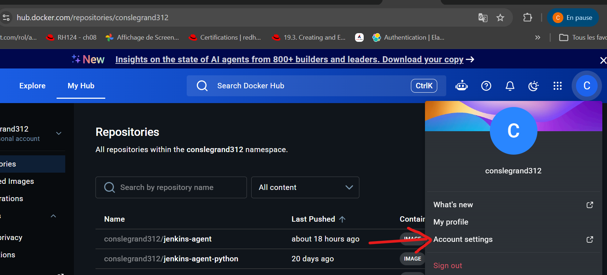
*Capture — menu du compte Docker Hub, option « Account settings ».*

**Étape 2 — Personal access tokens.** Dans le menu latéral gauche, cliquer sur **Personal access tokens**, puis sur **Generate new token**.

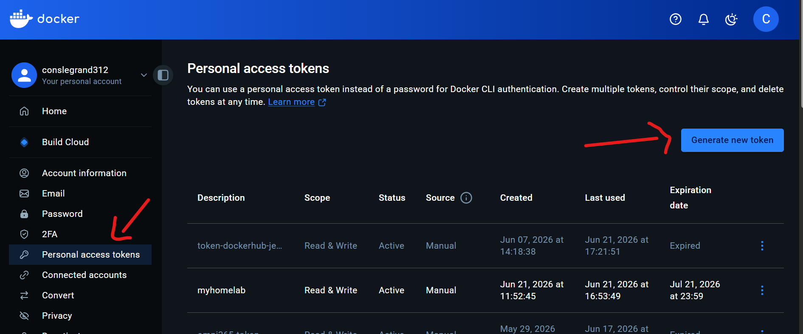
*Capture — page « Personal access tokens », bouton « Generate new token ».*

**Étape 3 — Paramètres du token.** Renseigner :
- **Access token description** : `token-for-jenkins`
- **Expiration date** : `30 days` (ou une durée adaptée à la durée du TP)
- **Access permissions** : `Read & Write`

Cliquer sur **Generate**.

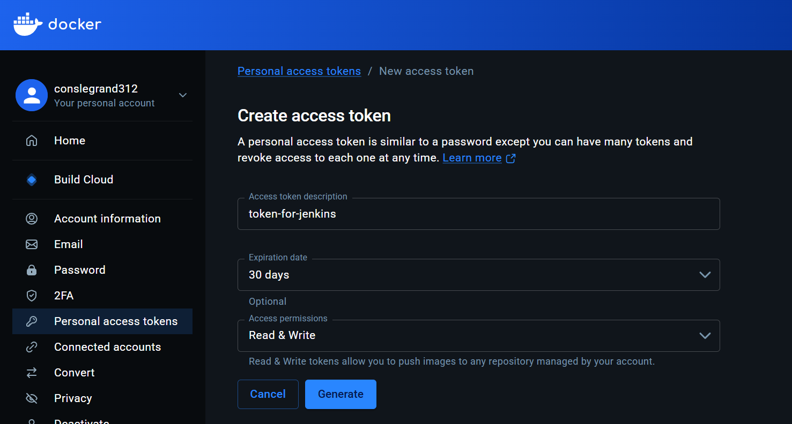
*Capture — formulaire « Create access token » avec description, expiration et permissions Read & Write.*

**Étape 4 — Copie du token.** Le token est affiché une seule fois. Cliquer sur **Copy** en face de la valeur du token (commençant par `dckr_pat_...`) et le conserver de côté : il sera collé dans Jenkins à la section suivante et ne sera plus jamais visible ensuite dans l'interface Docker Hub.

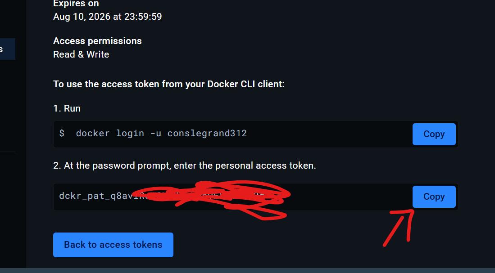
*Capture — token généré, avec la commande `docker login -u conslegrand312` associée et le bouton « Copy » permettant de récupérer la valeur du token (masquée ici pour la publication de ce guide).*

> ⚠️ Ce token doit être traité comme un mot de passe : il ne doit jamais être partagé, ni collé dans un chat, un dépôt Git, ou une capture d'écran destinée à être diffusée.

---

## 5. Enregistrement des identifiants dans Jenkins

Les identifiants Docker Hub ne doivent jamais apparaître en clair dans le `Jenkinsfile`. Ils sont enregistrés une fois dans le gestionnaire de credentials de Jenkins, puis référencés par leur identifiant dans le pipeline.

**Étape 1 — Accès à la gestion des credentials.** Sur le tableau de bord, cliquer sur l'icône ⚙️ en haut à droite pour ouvrir **Manage Jenkins**. Dans la section **Security**, cliquer sur la tuile **Credentials**.

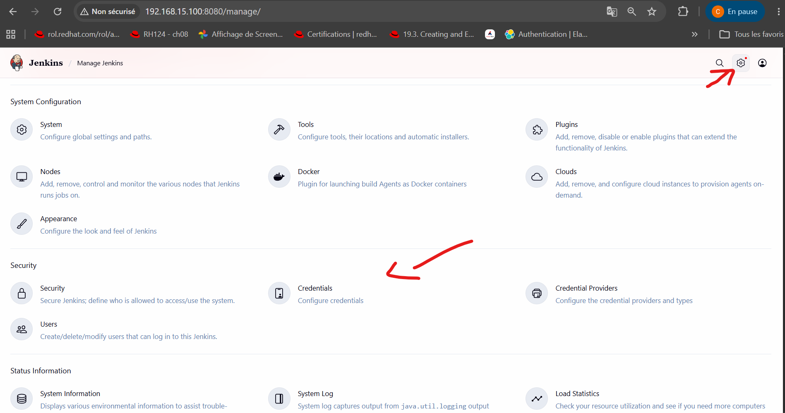
*Capture — page Manage Jenkins, section Security, tuile « Credentials ».*

**Étape 2 — Ajout d'un credential.** Aucun credential n'existe encore. Cliquer sur **Add Credentials**.

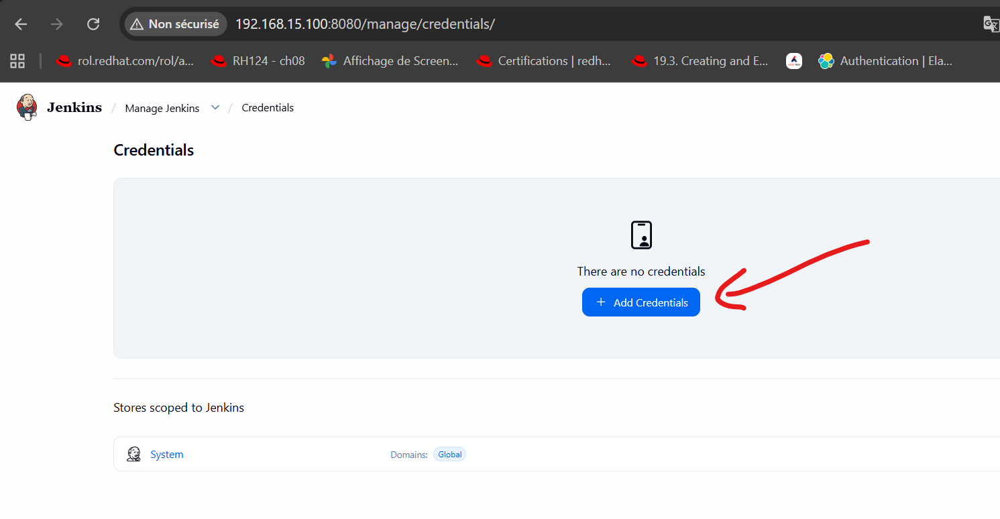
*Capture — page Credentials, « There are no credentials », bouton « Add Credentials ».*

**Étape 3 — Type de credential.** Dans la fenêtre **Add Credentials**, sélectionner le type **Username with password** (déjà sélectionné par défaut), puis cliquer sur **Next**.

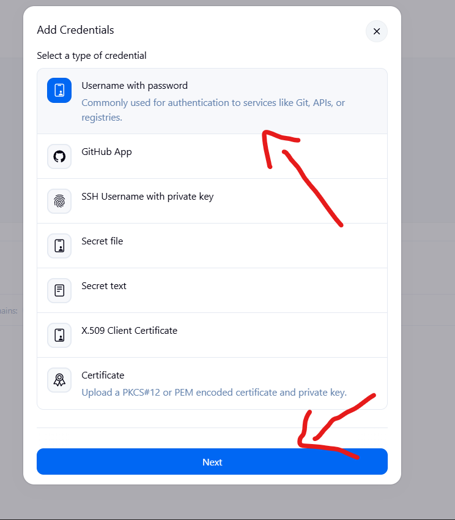
*Capture — fenêtre « Add Credentials », type « Username with password » sélectionné.*

**Étape 4 — Renseignement des champs.** Compléter le formulaire :
- **Scope** : `Global (Jenkins, nodes, items, all child items, etc)`
- **Username** : le nom d'utilisateur Docker Hub (ex. `conslegrand312`)
- **Password** : coller le token généré à la section précédente (pas le mot de passe du compte)
- **ID** : `dockerhub-credentials` (repris tel quel dans le `Jenkinsfile`)
- **Description** : `credentials pour acceder a docker hub`

Cliquer sur **Create**.

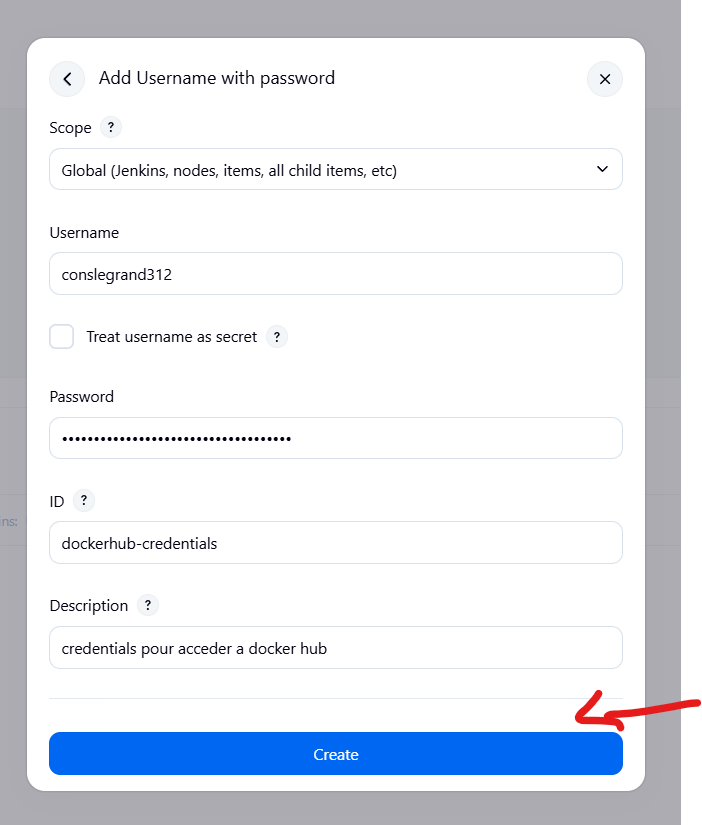
*Capture — formulaire « Add Username with password » complété, bouton « Create ».*

**Étape 5 — Vérification.** Le credential `dockerhub-credentials` apparaît désormais dans la liste, avec le nom d'utilisateur associé masqué en partie (`conslegrand312/******`).

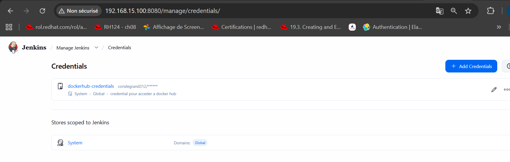
*Capture — liste des credentials, entrée `dockerhub-credentials` créée avec succès.*

---

## 6. Choix de l'image source

Pour ce TP, l'image publique **`nginx:alpine`** est utilisée comme image source : elle est légère, accessible sans authentification, et ne nécessite aucun fichier annexe. Le pipeline n'a besoin que d'un `Jenkinsfile`, sans arborescence de projet.

---

## 7. Rédaction du `Jenkinsfile`

Créer un fichier `Jenkinsfile` dans un nouveau dossier de travail (ex. `tp-jenkins-pull-push/Jenkinsfile`). Remplacer `mon-compte-dockerhub` par le nom d'utilisateur Docker Hub réel.

```groovy
pipeline {
    agent {
        label 'docker-agent'
    }

    environment {
        DOCKERHUB_CREDENTIALS = credentials('dockerhub-credentials')
        SOURCE_IMAGE = 'nginx:alpine'
        IMAGE_NAME = 'mon-compte-dockerhub/tp-jenkins-pull-push'
    }

    stages {

        stage('Pull') {
            steps {
                sh 'docker pull $SOURCE_IMAGE'
            }
        }

        stage('Tag') {
            steps {
                sh 'docker tag $SOURCE_IMAGE $IMAGE_NAME:$BUILD_NUMBER'
                sh 'docker tag $SOURCE_IMAGE $IMAGE_NAME:latest'
            }
        }

        stage('Push') {
            steps {
                sh 'echo $DOCKERHUB_CREDENTIALS_PSW | docker login -u $DOCKERHUB_CREDENTIALS_USR --password-stdin'
                sh 'docker push $IMAGE_NAME:$BUILD_NUMBER'
                sh 'docker push $IMAGE_NAME:latest'
            }
        }
    }

    post {
        always {
            sh 'docker logout'
        }
    }
}
```

### Explications

- **`agent { label 'docker-agent' }`** : force l'exécution sur l'agent Docker dynamique configuré au TP précédent
- **`credentials('dockerhub-credentials')`** : injecte automatiquement deux variables d'environnement à partir de l'identifiant Jenkins enregistré à la section 5 : `DOCKERHUB_CREDENTIALS_USR` (nom d'utilisateur) et `DOCKERHUB_CREDENTIALS_PSW` (mot de passe / token). Ces valeurs sont masquées dans les logs de la Console Output
- **`SOURCE_IMAGE`** : image publique récupérée telle quelle, sans modification de son contenu
- **stage Pull** : télécharge l'image source depuis Docker Hub vers l'agent
- **stage Tag** : crée deux nouvelles références locales pointant vers la même image — une avec le numéro de build (`$BUILD_NUMBER`, traçable et unique), une avec `latest`. `docker tag` ne duplique pas les données de l'image, il ajoute seulement une étiquette
- **stage Push** : authentification sur Docker Hub via `docker login --password-stdin` (le token n'apparaît jamais en clair dans une commande, contrairement à `docker login -p <token>`), puis publication des deux tags vers le namespace du compte
- **`post { always { docker logout } }`** : déconnexion systématique du registre en fin de build, y compris en cas d'échec d'une étape précédente

---

## 8. Création du job Pipeline

**Étape 1 — Nouvel item.** Sur le tableau de bord, cliquer sur **New Item**. Saisir le nom `tp2-pull-push`, sélectionner le type **Pipeline**, puis cliquer sur **OK**.

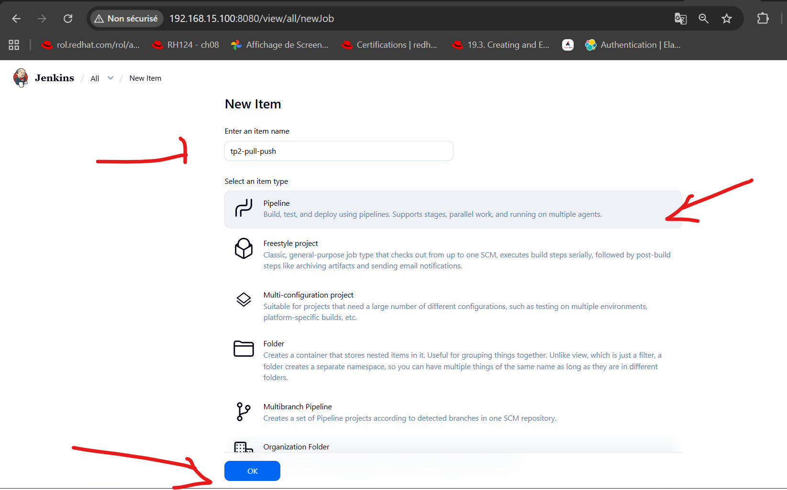
*Capture — écran « New Item » : nom `tp2-pull-push`, type « Pipeline » sélectionné.*

**Étape 2 — Script du pipeline.** Dans la page de configuration, aller dans l'onglet **Pipeline** (menu latéral gauche). Dans **Definition**, conserver **Pipeline script**, puis coller le contenu du `Jenkinsfile` rédigé à la section 7 dans le champ **Script**. Cliquer sur **Save**.

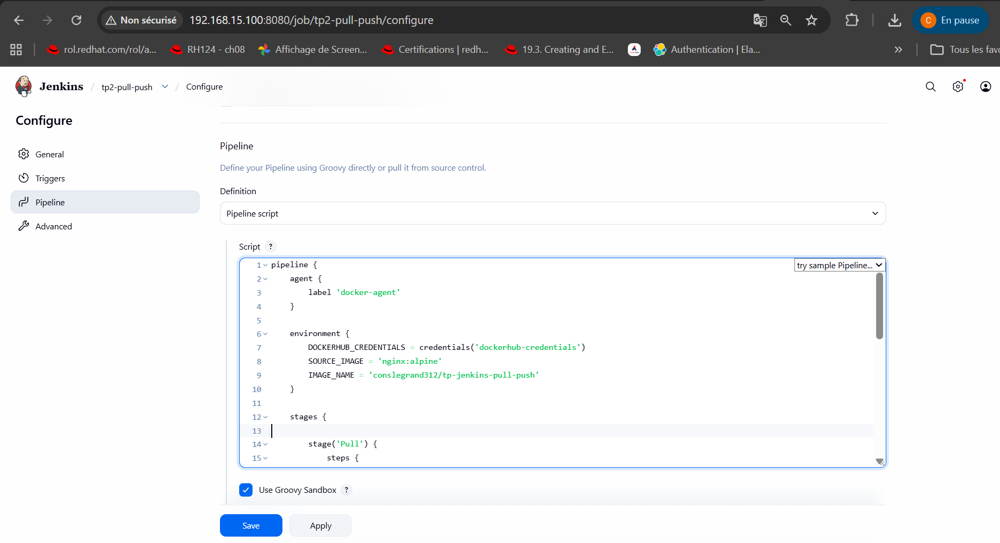
*Capture — onglet Pipeline > Definition « Pipeline script », avec les variables d'environnement (`DOCKERHUB_CREDENTIALS`, `SOURCE_IMAGE`, `IMAGE_NAME`) et le début du stage `Pull`.*

---

## 9. Exécution et vérification

**Étape 1 — Lancement du build.** Sur la page du job, cliquer sur **Build Now** (menu latéral gauche). Avant le premier lancement, la liste des builds est vide (**No builds**).

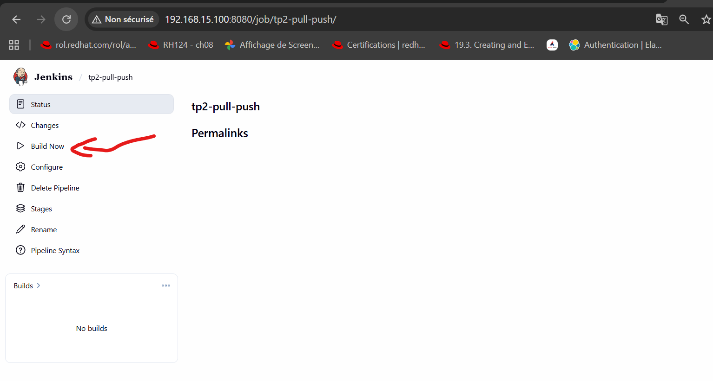
*Capture — page du job `tp2-pull-push`, bouton « Build Now », aucun build dans l'historique.*

Le build démarre et apparaît dans le panneau **Builds**, avec une barre de progression animée.

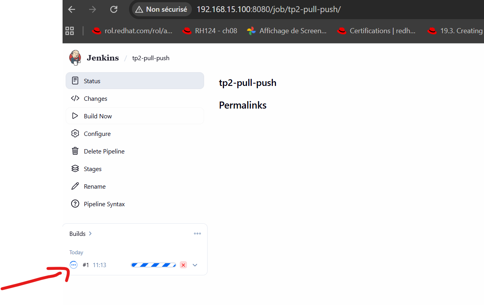
*Capture — build #1 en cours d'exécution, visible dans le panneau Builds avec son horodatage.*

**Étape 2 — Suivi de l'exécution.** Cliquer sur le build (ex. **#1**), puis sur **Console Output** dans le menu latéral gauche.

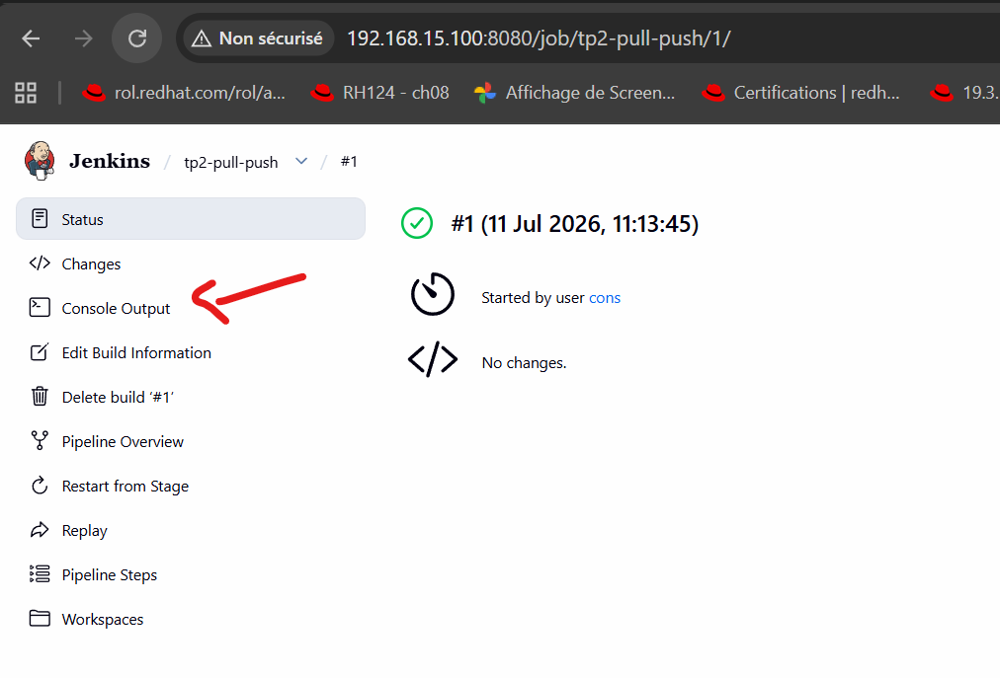
*Capture — page de statut du build #1, terminé avec succès (icône verte), lien « Console Output ».*

**Étape 3 — Lecture des logs.** La fin des logs confirme le bon déroulement des trois étapes : les couches de l'image sont poussées (ou déjà présentes côté registre), le tag `latest` est publié, puis l'étape `post { always { docker logout } }` s'exécute avant la fin du pipeline.

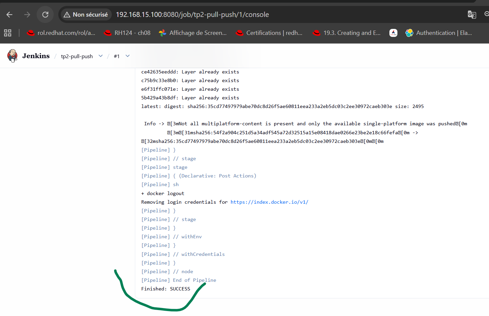
*Capture — fin de la Console Output : couches déjà présentes sur le registre (« Layer already exists »), déconnexion via `docker logout`, puis `Finished: SUCCESS`.*

**Étape 4 — Vérification sur Docker Hub.** Se connecter sur [hub.docker.com](https://hub.docker.com) et ouvrir la liste des dépôts (**Repositories**). Le dépôt `tp-jenkins-pull-push` doit apparaître, avec une date de dernière publication très récente.

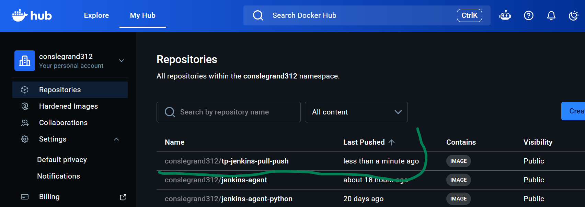
*Capture — liste des dépôts Docker Hub du compte `conslegrand312` : `tp-jenkins-pull-push` publié « less than a minute ago ».*

---

## 10. Nettoyage

Les images récupérées et retaguées restent en cache sur l'agent et peuvent s'accumuler au fil des builds.

```bash
docker exec jenkins docker image prune -f
```

> Cette commande est exécutée depuis le master via `docker exec` car c'est le master qui possède l'accès au socket Docker de l'hôte partagé avec les agents provisionnés dynamiquement.

---
Constantin S.E Bassene 
Ingenieur Cloud/Devops