# TP — Déploiement de Jenkins avec Docker Compose
---

## 1. Objectifs

Ce TP couvre le déploiement d'un serveur Jenkins conteneurisé avec Docker Compose, sa configuration initiale, la mise en place d'un agent Docker dynamique (cloud), puis l'exécution d'un pipeline de vérification sur cet agent.

---

## 2. Prérequis techniques

Environnement nécessaire :

- Docker Engine (≥ 20.x)
- Docker Compose (plugin `docker compose` ou binaire `docker-compose`)
- Un éditeur de texte
- Un terminal

Vérification de l'environnement :

```bash
docker --version
docker compose version
```

---

## 3. Architecture du TP

| Service  | Rôle                                      | Port exposé |
|----------|-------------------------------------------|-------------|
| jenkins  | Serveur Jenkins (master + interface web)  | 8080, 50000 |

Un agent Docker dynamique sera ensuite provisionné à la demande par Jenkins lui-même (section 11), à partir de l'image `conslegrand312/jenkins-agent:1.0.0`.

Les données Jenkins (jobs, plugins, configuration) sont persistées dans un **volume Docker nommé**, indépendant du cycle de vie du conteneur.

---

## 4. Préparation du projet

```bash
mkdir tp-jenkins-docker
cd tp-jenkins-docker
```

Un fichier `docker-compose.yml` est créé à la racine de ce dossier.

---

## 5. Récupération du GID du groupe `docker` sur l'hôte

Avant de rédiger le fichier `docker-compose.yml`, il est indispensable d'identifier le **GID (Group ID) réel du groupe `docker`** sur la machine hôte. Ce GID est **propre à chaque machine** : il varie d'un poste à l'autre, y compris entre étudiants sur des postes différents ou des VM différentes. Réutiliser un GID copié depuis le poste d'un tiers sans le vérifier soi-même est la cause la plus fréquente d'erreur dans ce TP.

Commande à exécuter sur l'hôte :

```bash
getent group docker
```

Résultat obtenu, sous la forme `nom_du_groupe:x:GID:membres` :

```
docker:x:988:cons
```

Ici, le GID est `988`. **Ce chiffre doit être relevé individuellement sur chaque poste** et reporté dans le champ `group_add` du `docker-compose.yml` (section suivante). Un GID local différent (par exemple `999` ou `1001`) doit être utilisé tel quel, sous peine d'obtenir une erreur de permission au démarrage de Jenkins ou lors de l'exécution de commandes Docker depuis un job.

---

## 6. Rédaction du fichier `docker-compose.yml`

```yaml
version: "3.8"

services:
  jenkins:
    image: jenkins/jenkins:lts-jdk17
    container_name: jenkins
    restart: unless-stopped
    ports:
      - "8080:8080"
      - "50000:50000"
    volumes:
      - jenkins_home:/var/jenkins_home
      - /var/run/docker.sock:/var/run/docker.sock
    group_add:
      - "988"   # GID du groupe docker relevé avec `getent group docker` — à adapter par poste

volumes:
  jenkins_home:
```

Éléments clés du fichier :

- **`image`** : image officielle Jenkins LTS, basée sur JDK 17
- **`ports`** : `8080` pour l'interface web, `50000` pour la connexion des agents distants
- **`jenkins_home`** : volume nommé assurant la persistance de la configuration
- **`/var/run/docker.sock`** : socket Docker de l'hôte monté dans le conteneur, permettant à Jenkins de piloter Docker
- **`group_add`** : ajoute l'utilisateur `jenkins` du conteneur au groupe `docker` de l'hôte, avec le GID relevé à l'étape précédente

> **Remarque de sécurité.** Monter le socket Docker de l'hôte dans le conteneur donne à Jenkins un accès équivalent à root sur la machine hôte. Pratique acceptable en TP isolé, à proscrire en production sans mesures complémentaires (rootless Docker, agents dédiés, Docker-in-Docker isolé).

---

## 7. Lancement de Jenkins

```bash
docker compose up -d
```

Vérification de l'état du conteneur :

```bash
docker ps
```

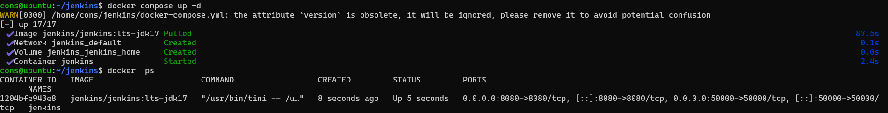
*Capture — exécution de `docker compose up -d` (création du réseau, du volume et du conteneur) suivie de `docker ps` confirmant que le conteneur `jenkins` est démarré et que les ports 8080/50000 sont bien mappés.*

---

## 8. Erreur `Permission denied` liée au GID Docker (diagnostic)

Si le GID indiqué dans `group_add` ne correspond pas au GID réel du groupe `docker` sur l'hôte — ou si le conteneur n'a pas été recréé après modification du fichier — l'erreur suivante peut apparaître, typiquement lors de l'exécution d'une commande Docker depuis un job Jenkins :

```
java.net.BindException: Permission denied
	at ... com.github.dockerjava.transport.UnixSocket...
```

Ce message est trompeur : il ne s'agit pas d'un conflit de port, mais d'un refus d'accès de l'utilisateur `jenkins` (à l'intérieur du conteneur) au socket `/var/run/docker.sock` monté depuis l'hôte.

Étapes de diagnostic :

```bash
# 1. Vérifier le GID réel du groupe docker sur l'hôte
getent group docker

# 2. Vérifier que ce GID est bien appliqué à l'utilisateur jenkins dans le conteneur
docker exec -it jenkins id
```

Le GID relevé à l'étape 1 doit apparaître dans la liste des groupes retournée à l'étape 2. S'il est absent, la modification du `docker-compose.yml` n'a pas été prise en compte : `group_add` nécessite une recréation complète du conteneur, un simple redémarrage ne suffit pas.

```bash
docker compose down
docker compose up -d --force-recreate
```

---

## 9. Récupération du mot de passe administrateur initial

```bash
docker exec jenkins cat /var/jenkins_home/secrets/initialAdminPassword
```

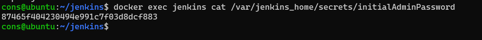
*Capture — la commande renvoie directement le mot de passe administrateur initial, à copier pour l'étape suivante.*

---

## 10. Configuration initiale via l'interface web

Ouvrir un navigateur à l'adresse `http://<adresse-de-la-machine>:8080`.

**Étape 1 — Déverrouillage.** Coller le mot de passe récupéré à la section précédente dans le champ **Administrator password**, puis cliquer sur **Continue**.

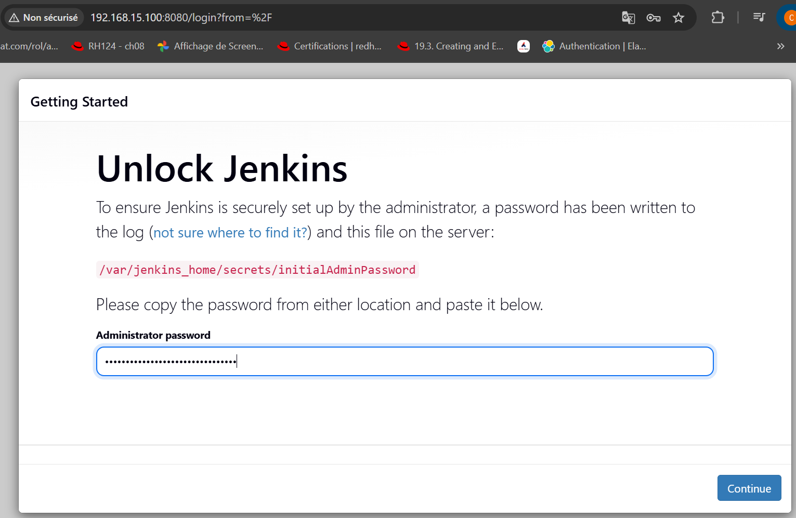
*Capture — écran « Unlock Jenkins » demandant le mot de passe administrateur initial.*

**Étape 2 — Plugins.** Cliquer sur **Install suggested plugins** pour installer automatiquement les plugins de base (Git, Pipeline, etc.).

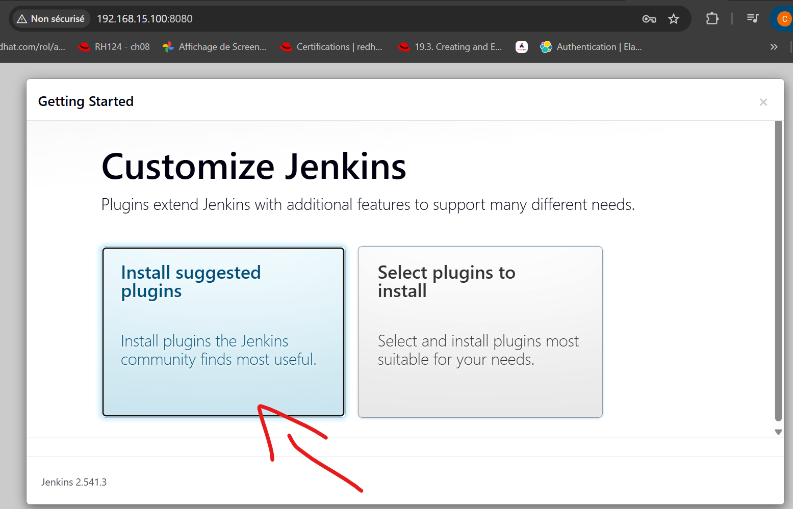
*Capture — écran « Customize Jenkins », choix « Install suggested plugins ».*

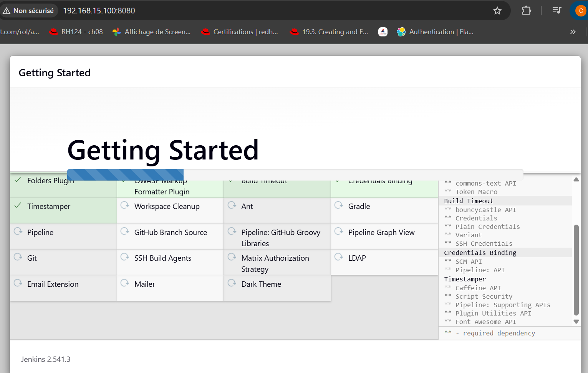
*Capture — progression de l'installation des plugins sélectionnés.*

**Étape 3 — Compte administrateur.** Renseigner **Username**, **Password**, **Confirm password**, **Full name**, puis cliquer sur **Save and Continue**.

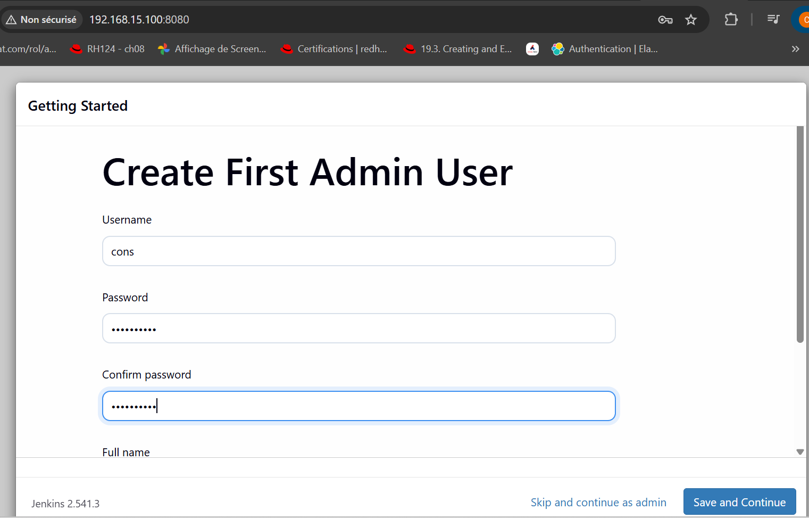
*Capture — formulaire « Create First Admin User ».*

**Étape 4 — URL de l'instance.** Conserver la valeur par défaut (`http://<adresse>:8080/`) et cliquer sur **Save and Finish**, puis sur **Start using Jenkins**.

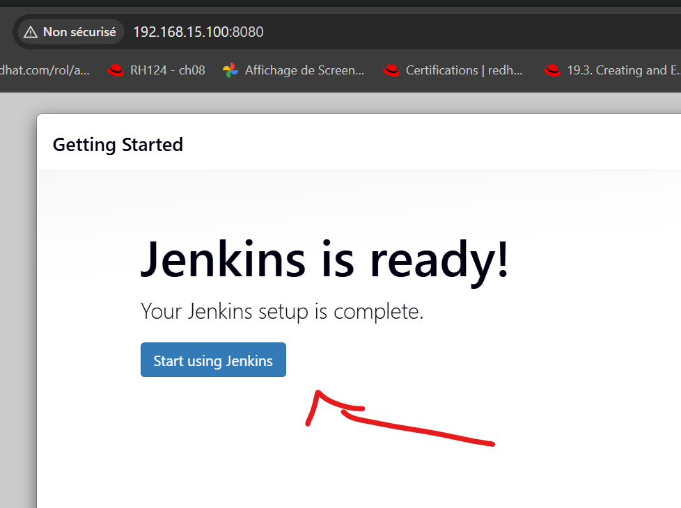
*Capture — écran « Jenkins is ready! », bouton « Start using Jenkins ».*

Jenkins est alors opérationnel et affiche le tableau de bord principal.

---

## 11. Configuration de l'agent Docker dynamique (cloud)

Le job de test de la section suivante s'exécute sur un **agent Docker provisionné à la demande**, et non sur le master Jenkins. Cette section doit donc être réalisée avant la création du pipeline.

**Étape 1 — Accès à la gestion des clouds.** Sur le tableau de bord, cliquer sur l'icône ⚙️ **Manage Jenkins** en haut à droite. Un bandeau signale : *« Building on the built-in node can be a security issue »*. Cliquer sur le bouton **Set up cloud**.

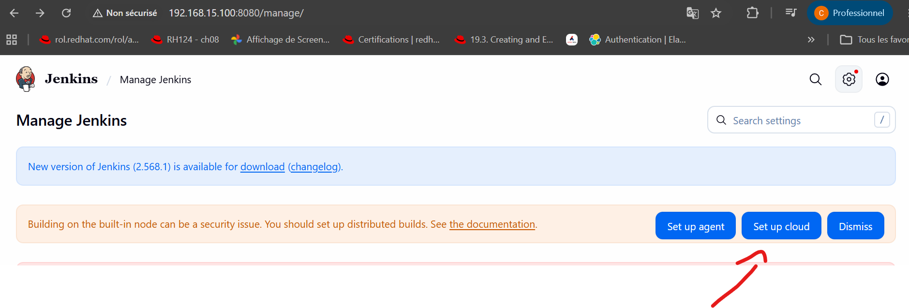
*Capture — page Manage Jenkins, bouton « Set up cloud » dans le bandeau d'avertissement.*

**Étape 2 — Absence de plugin.** À ce stade, aucun plugin cloud n'est installé. Cliquer sur **Install a plugin**.

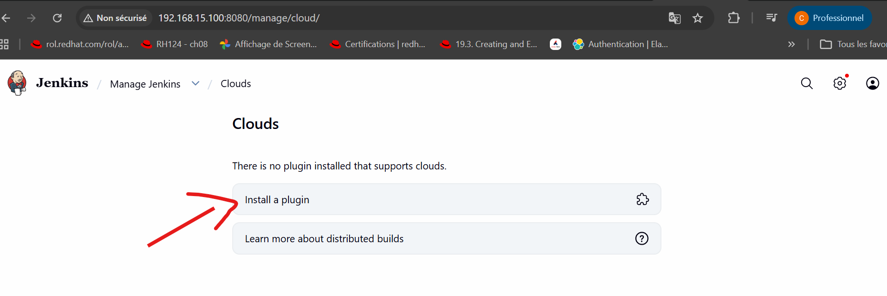
*Capture — page Manage Jenkins > Clouds : « There is no plugin installed that supports clouds » > bouton « Install a plugin ».*

**Étape 3 — Installation du plugin Docker.** Dans le champ de recherche, saisir `Cloud Providers`. Cocher la case du plugin **Docker**, puis cliquer sur **Install** en haut à droite.

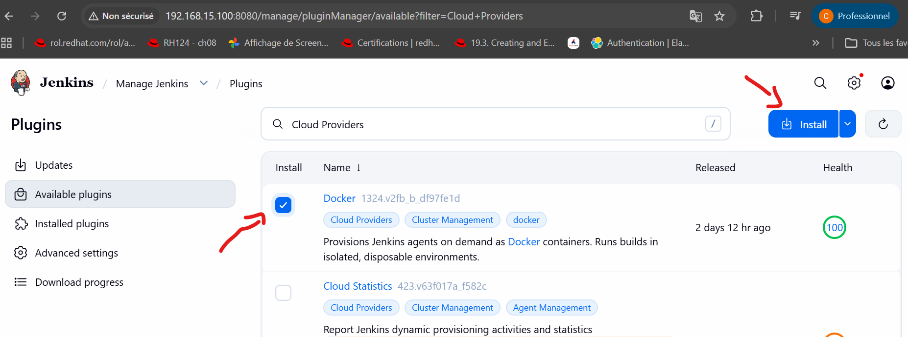
*Capture — Manage Jenkins > Plugins > Available plugins, recherche « Cloud Providers », plugin Docker coché.*

**Étape 4 — Fin d'installation.** Une fois tous les plugins listés en **Success**, cocher **Restart Jenkins when installation is complete and no jobs are running** pour redémarrer Jenkins et activer le plugin.

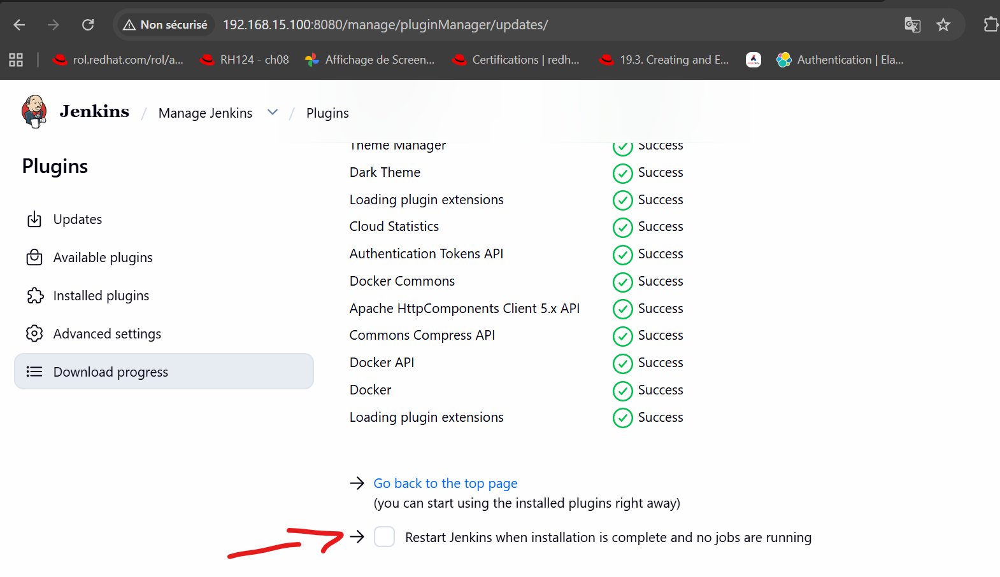
*Capture — page de progression du téléchargement, case « Restart Jenkins when installation is complete ».*

**Étape 5 — Reconnexion.** Après le redémarrage, se reconnecter avec les identifiants administrateur créés à la section 10.

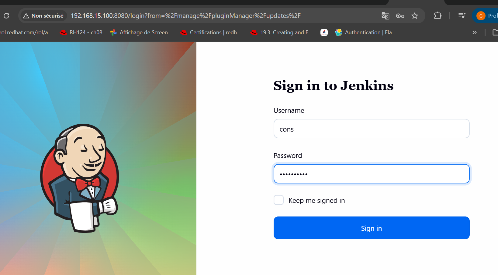
*Capture — écran « Sign in to Jenkins » après le redémarrage consécutif à l'installation du plugin.*

**Étape 6 — Retour sur Manage Jenkins.** Cliquer à nouveau sur l'icône ⚙️ **Manage Jenkins**, puis sur le bouton **Set up cloud** dans le bandeau d'avertissement.

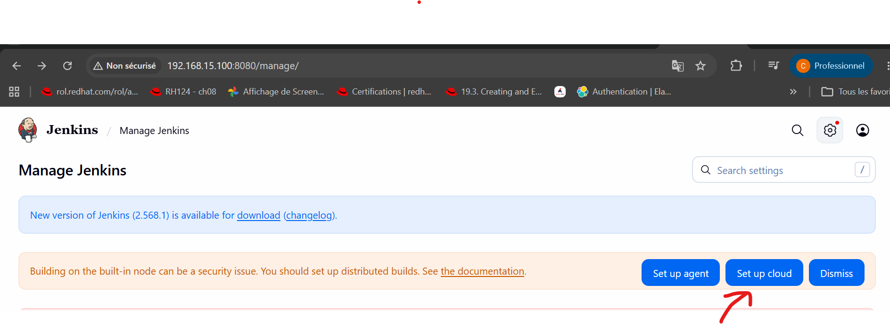
*Capture — page Manage Jenkins après redémarrage, bouton « Set up cloud ».*

**Étape 7 — Création du cloud.** Le plugin étant désormais actif, cliquer sur **New cloud**.

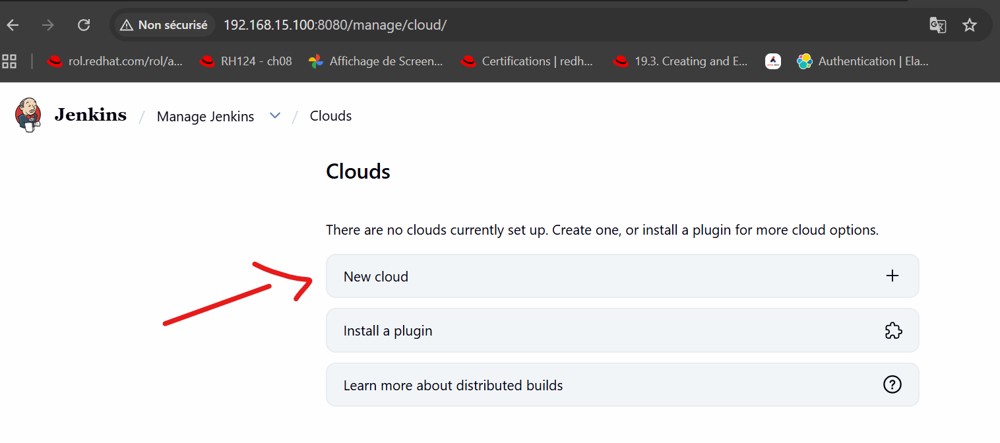
*Capture — Manage Jenkins > Clouds : « There are no clouds currently set up » > bouton « New cloud ».*

**Étape 8 — Nom et type.** Renseigner le champ **Cloud name** avec `docker-agent`, sélectionner le type **Docker**, puis cliquer sur **Create**.

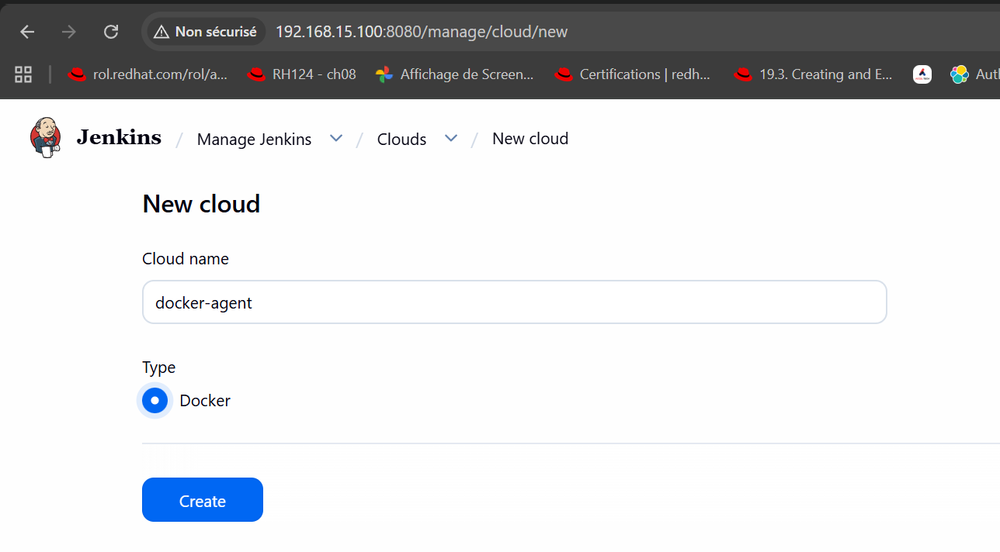
*Capture — formulaire « New cloud » : nom `docker-agent`, type Docker.*

**Étape 9 — Sections de configuration.** La page de configuration du cloud affiche deux sections dépliables : **Docker Cloud details** (connexion au démon Docker) et **Docker Agent templates** (modèle de conteneur agent). Cliquer sur **Docker Cloud details** pour la déplier.

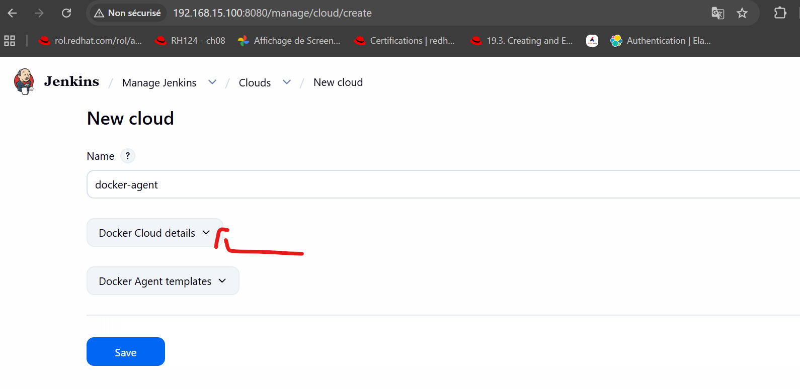
*Capture — page « New cloud », accordéons « Docker Cloud details » et « Docker Agent templates ».*

**Étape 10 — Connexion au démon Docker.** Dans le champ **Docker Host URI**, saisir `unix:///var/run/docker.sock`. Cliquer sur **Test Connection** : la version du démon Docker s'affiche (ex. `Version = 29.6.1, API Version = 1.55`), confirmant que la connexion fonctionne. Cocher **Enabled**.

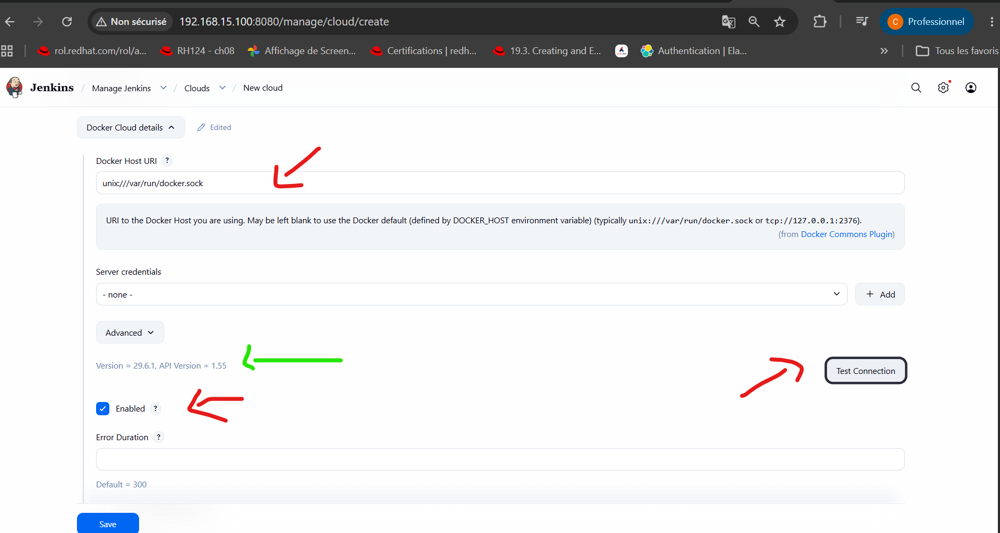
*Capture — « Docker Cloud details » : Docker Host URI renseigné, résultat du Test Connection, case Enabled cochée.*

**Étape 11 — Modèle d'agent (Docker Agent templates).** Déplier la section **Docker Agent templates** puis cliquer sur **Add Docker Template**. Renseigner :

- **Labels** : `docker-agent`
- **Docker Image** : `conslegrand312/jenkins-agent:1.0.0`
- **Remote Filesystem Root** : `/home/jenkins`
- **Connect method** : `Connect with JNLP`

> Aucune capture n'a été fournie pour cette sous-étape précise : suivre les libellés de champs ci-dessus dans l'interface, qui correspondent à ceux affichés une fois « Docker Agent templates » déplié à l'étape 9.

Cliquer sur **Save** en bas de page pour enregistrer l'ensemble de la configuration du cloud.

---

## 12. Création et exécution d'un pipeline de test

Ce job vérifie que Jenkins peut déclencher un build sur l'agent Docker configuré à la section précédente, et que cet agent a lui-même accès au démon Docker de l'hôte.

**Étape 1 — Nouvel item.** Sur le tableau de bord, cliquer sur **New Item** (menu latéral gauche). Saisir un nom (ex. `firts-test`), sélectionner le type **Pipeline**, puis cliquer sur **OK**.

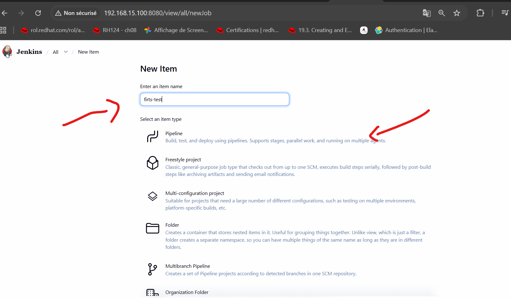
*Capture — écran « New Item » : nom du job et sélection du type « Pipeline ».*

**Étape 2 — Script du pipeline.** Dans la page de configuration du job, aller dans l'onglet **Pipeline** (menu latéral gauche). Dans **Definition**, conserver **Pipeline script**, puis coller le script suivant dans le champ **Script** :

```groovy
pipeline {
    agent any

    stages {
        stage('Hello') {
            steps {
                sh 'docker ps'
            }
        }
    }
}
```

Cliquer sur **Save**.

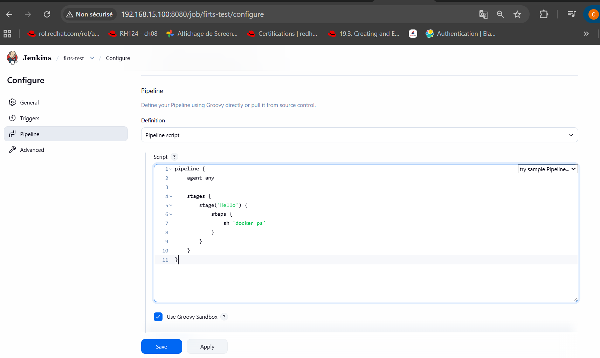
*Capture — onglet Pipeline > Definition « Pipeline script », avec le script `agent any` / `sh 'docker ps'`.*

**Étape 3 — Exécution.** Cliquer sur **Build Now** (menu latéral gauche), puis ouvrir le build créé et cliquer sur **Console Output**.

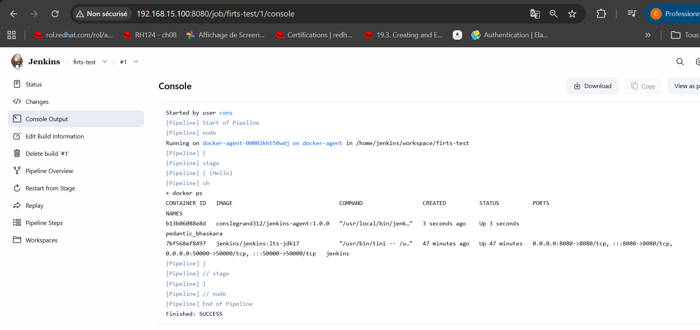
*Capture — Console Output : le pipeline s'exécute sur `docker-agent-00002kht50wdj on docker-agent` (l'agent Docker provisionné dynamiquement à partir de l'image `conslegrand312/jenkins-agent:1.0.0`), et la commande `docker ps` liste à la fois le conteneur de l'agent et le conteneur `jenkins` du master. Le build se termine par `Finished: SUCCESS`.*

Ce résultat confirme deux points : le cloud Docker configuré à la section 11 fonctionne (l'agent a bien été créé à la volée), et cet agent a bien accès au démon Docker de l'hôte.

---

## 13. Persistance des données

Démonstration de la persistance via le volume nommé :

```bash
docker compose down
docker compose up -d
```

Après reconnexion sur `http://localhost:8080`, le job `firts-test`, le cloud `docker-agent` et le compte administrateur sont toujours présents : les données sont stockées dans le volume `jenkins_home`, indépendant du conteneur.

Test complémentaire — suppression du volume :

```bash
docker compose down -v
```

Cette commande supprime également `jenkins_home` : toute la configuration est perdue, illustrant la différence entre suppression du conteneur et suppression du volume.

---

## 14. Nettoyage de l'environnement

```bash
docker compose down -v
```

Le flag `-v` supprime le volume `jenkins_home` en plus des conteneurs : l'ensemble de la configuration Jenkins est effacé.

---

## 16. Prochaines Etapes

- Forcer explicitement l'exécution sur l'agent Docker avec `agent { label 'docker-agent' }`
- Intégration avec un dépôt Git (webhook GitHub/GitLab)
- Sécurisation de l'accès HTTPS via un reverse proxy (Nginx/Traefik) devant Jenkins

